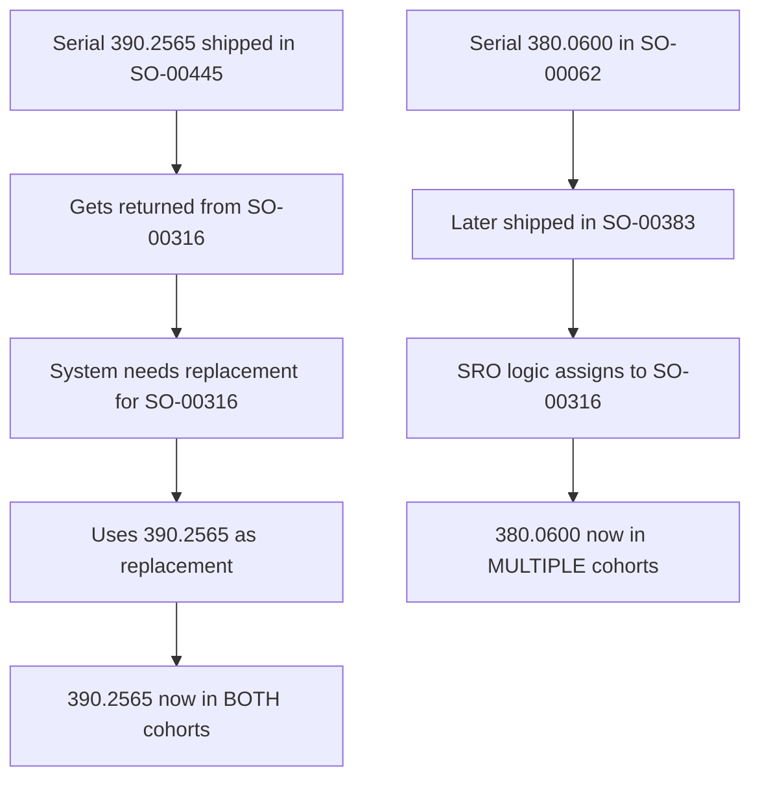
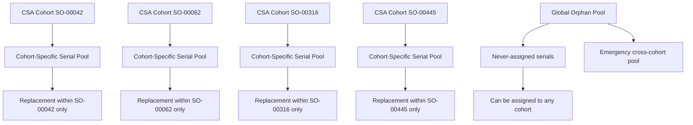

# Cohort Isolation Implementation Plan

## Problem Statement

**Serial numbers are appearing in multiple CSA cohorts**, violating the principle that each serial should belong to exactly one Customer Service Agreement. This creates confusion in warranty tracking, service responsibilities, and contract management.

## Root Cause Analysis

### Current Flawed Logic:


### The Core Issue:
**STEP2 replacement logic doesn't enforce cohort boundaries** - it treats all returned serials as a global pool for any cohort needing replacements.

## Solution Architecture

### Enhanced Cohort Isolation Model:


## Implementation Plan

### Phase 1: Data Structure Enhancement (Week 1)

**1.1 Create Cohort Tracking System**
```python
class CohortManager:
    def __init__(self):
        self.cohort_serials = {}      # cohort_id -> set(serials)
        self.serial_cohorts = {}      # serial -> cohort_id
        self.orphan_pool = set()      # serials never assigned to cohorts
        self.cross_cohort_violations = []
    
    def assign_initial_serial(self, serial, cohort_id):
        """Assign serial to cohort on first shipment"""
        if serial in self.serial_cohorts:
            raise ValueError(f"Serial {serial} already assigned to {self.serial_cohorts[serial]}")
        
        self.serial_cohorts[serial] = cohort_id
        if cohort_id not in self.cohort_serials:
            self.cohort_serials[cohort_id] = set()
        self.cohort_serials[cohort_id].add(serial)
    
    def get_cohort_available_serials(self, cohort_id):
        """Get all returned/available serials from specific cohort"""
        cohort_serials = self.cohort_serials.get(cohort_id, set())
        return [s for s in cohort_serials if self.is_available_for_replacement(s)]
    
    def validate_replacement(self, replacement_serial, target_cohort):
        """Ensure replacement doesn't violate cohort isolation"""
        if replacement_serial in self.serial_cohorts:
            original_cohort = self.serial_cohorts[replacement_serial]
            if original_cohort != target_cohort:
                return {
                    'valid': False,
                    'violation_type': 'cross_cohort',
                    'original_cohort': original_cohort,
                    'target_cohort': target_cohort
                }
        
        return {'valid': True}
```

**1.2 Enhanced Replacement Logic**
```python
def find_replacement_serial(returned_serial_info, target_cohort):
    """Find replacement using cohort isolation rules"""
    
    # Step 1: Try same cohort first
    same_cohort_candidates = cohort_manager.get_cohort_available_serials(target_cohort)
    if same_cohort_candidates:
        return {
            'replacement': select_best_candidate(same_cohort_candidates),
            'source': 'same_cohort',
            'cohort': target_cohort
        }
    
    # Step 2: Try orphan pool
    orphan_candidates = [s for s in cohort_manager.orphan_pool 
                        if is_available_for_replacement(s)]
    if orphan_candidates:
        selected = select_best_candidate(orphan_candidates)
        # Assign orphan to target cohort
        cohort_manager.assign_initial_serial(selected, target_cohort)
        return {
            'replacement': selected,
            'source': 'orphan_pool',
            'cohort': target_cohort
        }
    
    # Step 3: Emergency cross-cohort (with explicit tracking)
    if ALLOW_EMERGENCY_CROSS_COHORT:
        all_candidates = get_all_available_serials()
        if all_candidates:
            selected = select_best_candidate(all_candidates)
            violation = {
                'serial': selected,
                'original_cohort': cohort_manager.serial_cohorts[selected],
                'target_cohort': target_cohort,
                'reason': 'emergency_shortage',
                'timestamp': datetime.now()
            }
            cohort_manager.cross_cohort_violations.append(violation)
            return {
                'replacement': selected,
                'source': 'emergency_cross_cohort',
                'cohort': target_cohort,
                'violation': violation
            }
    
    return None  # No replacement available
```

### Phase 2: STEP2 Algorithm Modification (Week 2)

**2.1 Modify Chain Building Logic**
```python
def build_replacement_chains_with_cohort_isolation():
    """Enhanced chain building that respects cohort boundaries"""
    
    for cohort_id in csa_cohorts:
        cohort_chains = []
        
        # Get all initial shipments for this cohort
        initial_shipments = get_initial_cohort_shipments(cohort_id)
        
        for shipment in initial_shipments:
            for serial in shipment.serials:
                # Assign serial to cohort on first appearance
                cohort_manager.assign_initial_serial(serial, cohort_id)
                
                # Build replacement chain within cohort boundaries
                chain = build_single_chain_isolated(serial, cohort_id)
                cohort_chains.append(chain)
        
        # Process returns and find replacements within cohort
        process_cohort_returns_isolated(cohort_id, cohort_chains)
    
    # Handle orphans separately
    process_orphan_serials()
```

**2.2 SRO (Standalone Returned Orphan) Assignment Fix**
```python
def assign_sro_with_cohort_respect(sro_serial, sro_info):
    """Assign SRO respecting original cohort membership"""
    
    # Check if serial has existing cohort assignment
    if sro_serial in cohort_manager.serial_cohorts:
        original_cohort = cohort_manager.serial_cohorts[sro_serial]
        
        # Verify the cohort still has capacity
        if cohort_has_capacity(original_cohort):
            assign_sro_to_cohort(sro_serial, original_cohort)
            return {
                'assigned_cohort': original_cohort,
                'reason': 'original_cohort_membership'
            }
        else:
            # Original cohort full - this is a data quality issue
            log_cohort_capacity_violation(sro_serial, original_cohort)
    
    # If no existing cohort or capacity issue, add to orphan pool
    cohort_manager.orphan_pool.add(sro_serial)
    return {
        'assigned_cohort': None,
        'reason': 'added_to_orphan_pool'
    }
```

### Phase 3: Validation and Reporting (Week 3)

**3.1 Cross-Cohort Violation Detection**
```python
def detect_cross_cohort_violations(clinic_data):
    """Analyze existing data for cohort violations"""
    
    violations = []
    
    for cohort_id, cohort_data in clinic_data['csa_replacement_chains'].items():
        for chain in cohort_data['chains']:
            for serial in chain['serials']:
                # Check if serial appears in other cohorts
                other_cohorts = find_serial_in_other_cohorts(serial, cohort_id, clinic_data)
                
                if other_cohorts:
                    violations.append({
                        'serial': serial,
                        'primary_cohort': cohort_id,
                        'also_in_cohorts': other_cohorts,
                        'violation_type': 'cross_cohort_assignment',
                        'impact': 'warranty_tracking_confusion'
                    })
    
    return violations
```

**3.2 Enhanced Reporting**
```python
def generate_cohort_isolation_report():
    """Generate report showing cohort integrity"""
    
    report = {
        'cohort_summary': {},
        'violations': [],
        'orphan_analysis': {},
        'recommendations': []
    }
    
    for cohort_id in cohort_manager.cohort_serials:
        serials = cohort_manager.cohort_serials[cohort_id]
        report['cohort_summary'][cohort_id] = {
            'total_serials': len(serials),
            'in_field': count_in_field_serials(serials),
            'returned': count_returned_serials(serials),
            'isolation_score': calculate_isolation_score(cohort_id)
        }
    
    # Detect and report violations
    report['violations'] = detect_cross_cohort_violations()
    
    # Analyze orphan pool
    report['orphan_analysis'] = {
        'total_orphans': len(cohort_manager.orphan_pool),
        'potential_assignments': analyze_orphan_assignments(),
        'recommendations': generate_orphan_recommendations()
    }
    
    return report
```

### Phase 4: Migration Strategy (Week 4)

**4.1 Fix Existing Violations**
```python
def migrate_existing_violations():
    """Clean up existing cross-cohort assignments"""
    
    violations = detect_cross_cohort_violations()
    
    for violation in violations:
        serial = violation['serial']
        primary_cohort = violation['primary_cohort']
        conflicting_cohorts = violation['also_in_cohorts']
        
        # Strategy: Keep serial in earliest cohort by date
        earliest_cohort = find_earliest_cohort_by_date([primary_cohort] + conflicting_cohorts)
        
        # Remove from other cohorts
        for cohort in [primary_cohort] + conflicting_cohorts:
            if cohort != earliest_cohort:
                remove_serial_from_cohort(serial, cohort)
                
                # Find alternative replacement if needed
                replacement = find_alternative_replacement(cohort, serial)
                if replacement:
                    substitute_serial_in_cohort(cohort, serial, replacement)
                else:
                    log_unresolved_replacement_need(cohort, serial)
        
        # Confirm assignment to earliest cohort
        confirm_serial_in_cohort(serial, earliest_cohort)
```

## Expected Results

### Before Implementation:
- Serial 390.2565 in cohorts SO-00316 AND SO-00445
- Serial 380.0600 in cohorts SO-00062 AND SO-00316  
- Serial 380.0596 appearing multiple times in SO-00062
- Warranty tracking confusion
- CSA contract boundary violations

### After Implementation:
- Each serial belongs to exactly ONE cohort
- Clear ownership and responsibility per CSA
- Proper warranty tracking
- Audit trail for any emergency cross-cohort assignments
- Orphan pool for unassigned serials

### Success Metrics:
- **0 cross-cohort violations** for new assignments
- **Clear migration path** for existing violations
- **100% cohort isolation** for CSA boundary integrity
- **Transparent reporting** of any emergency exceptions

## Business Impact

### CSA Management:
- Clear separation of customer agreements
- Accurate warranty tracking per cohort
- Simplified service responsibility

### Operational Benefits:
- Reduced confusion in replacement decisions
- Better inventory management per cohort
- Clearer audit trails for compliance

### Risk Mitigation:
- Prevents accidental mixing of customer agreements
- Maintains contractual boundaries
- Enables proper cost tracking per CSA

This implementation ensures that **CSA cohorts remain isolated** while providing emergency mechanisms when absolutely necessary, with full transparency and tracking.