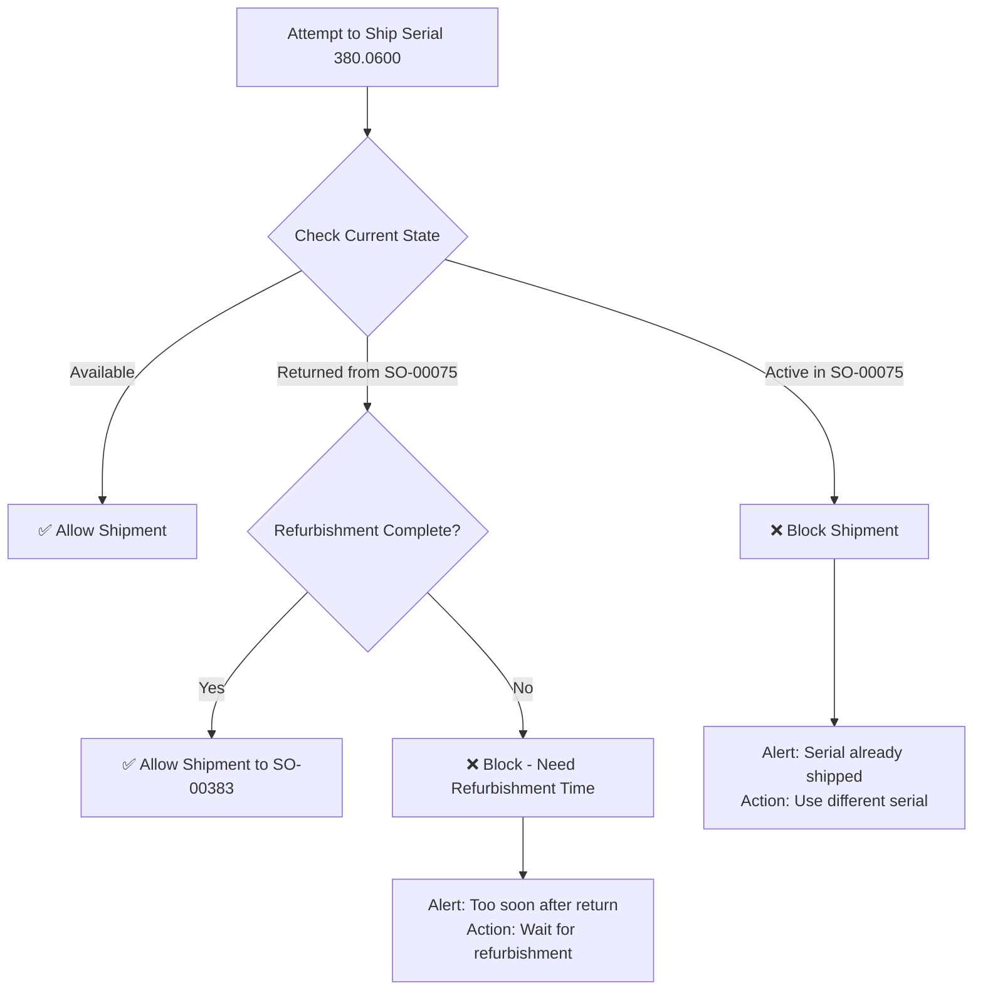

# Implementation Plan: Enhanced Duplicate Detection & Prevention

## Executive Summary

**The Problem**: Current STEP2 flags legitimate serial number reuse as "duplicates"
**The Solution**: Implement state-aware duplicate detection that distinguishes between:
- ❌ **True Duplicates**: Same serial active in multiple orders simultaneously 
- ✅ **Legitimate Reuse**: Serial returned, refurbished, and properly reused

## Core Questions Answered

### Q: "How would you prevent it being used more than once if it's a duplicate?"
**A: State-Based Validation System**



### Q: "Why is it a duplicate?"
**A: Context Determines Classification**

| Scenario | Classification | Reason |
|----------|---------------|---------|
| Serial in SO-A (active) + SO-B (active) | **TRUE DUPLICATE** | Same physical item can't be in two places |
| Serial in SO-A → Returned → SO-B | **LEGITIMATE REUSE** | Proper business workflow |
| Serial in SO-A → SO-B (no return) | **TRUE DUPLICATE** | Missing return linkage |
| Serial in SO-A → Returned same day → SO-B | **SUSPICIOUS** | No time for refurbishment |

## Technical Implementation Plan

### Phase 1: Enhanced Analysis Engine (Week 1-2)

**Goal**: Upgrade STEP2 to provide accurate duplicate classification

**Tasks**:
1. **Create Timeline Analysis Function**
   ```python
   def analyze_serial_timeline(serial_number, clinic_data):
       events = extract_all_events(serial_number, clinic_data)
       timeline = sort_chronologically(events)
       return classify_usage_pattern(timeline)
   ```

2. **Implement State Logic**
   ```python
   def get_serial_state_at_date(serial_number, date, events):
       # Calculate if serial was available/shipped/returned at specific date
       state = 'available'
       for event in events:
           if event.date <= date:
               if event.type == 'shipment':
                   state = 'shipped'
               elif event.type == 'return':
                   state = 'available'
       return state
   ```

3. **Create Smart Duplicate Detection**
   ```python
   def detect_smart_duplicates(clinic_data):
       results = {
           'true_duplicates': [],      # Actually problematic
           'legitimate_reuse': [],     # Normal business process
           'data_quality_issues': [],  # Missing return records, etc.
           'suspicious_patterns': []   # Fast turnarounds, etc.
       }
       # Implementation logic here
       return results
   ```

### Phase 2: Prevention System (Week 3-4)

**Goal**: Prevent true duplicates at shipment time

**Tasks**:
1. **Serial State Tracking Database**
   ```sql
   CREATE TABLE serial_tracking (
       serial_number VARCHAR(50) PRIMARY KEY,
       current_state ENUM('available', 'shipped', 'returned', 'refurbishing'),
       current_order VARCHAR(50),
       last_shipment_date DATE,
       last_return_date DATE,
       refurbishment_complete_date DATE
   );
   ```

2. **Real-Time Validation API**
   ```python
   @api_endpoint('/validate-serial-shipment')
   def validate_serial_shipment(serial_number, new_order_id):
       current_state = get_current_serial_state(serial_number)
       
       if current_state == 'shipped':
           return {
               'allowed': False,
               'reason': 'Serial currently active in another order',
               'resolution': 'Process return first or use different serial'
           }
       
       if current_state == 'refurbishing':
           days_since_return = get_days_since_return(serial_number)
           if days_since_return < MINIMUM_REFURBISHMENT_DAYS:
               return {
                   'allowed': False,
                   'reason': f'Refurbishment incomplete ({days_since_return} days)',
                   'resolution': f'Wait {MINIMUM_REFURBISHMENT_DAYS - days_since_return} more days'
               }
       
       return {'allowed': True}
   ```

3. **Integration with Shipping System**
   - Add validation hooks to existing shipment processing
   - Create override mechanisms for emergency situations
   - Log all validation decisions for audit

### Phase 3: Monitoring & Reporting (Week 5-6)

**Goal**: Provide clear visibility into serial number lifecycle

**Tasks**:
1. **Enhanced STEP2 Reports**
   - Clear separation of true duplicates vs legitimate reuse
   - Timeline visualization for flagged serials
   - Business impact assessment

2. **Real-Time Dashboard**
   - Serial number state tracking
   - Return processing queues
   - Refurbishment status monitoring

3. **Automated Alerts**
   - True duplicate attempts
   - Missing return documentation
   - Unusual patterns (too-fast turnarounds)

## Business Rules Implementation

### Rule 1: Single Active State
```python
RULE_SINGLE_ACTIVE = {
    'description': 'A serial can only be active in one order at a time',
    'validation': lambda serial: count_active_orders(serial) <= 1,
    'severity': 'CRITICAL'
}
```

### Rule 2: Return Linkage
```python
RULE_RETURN_LINKAGE = {
    'description': 'Returns must reference valid original orders',
    'validation': lambda return_record: validate_return_order_exists(return_record),
    'severity': 'HIGH'
}
```

### Rule 3: Refurbishment Time
```python
RULE_REFURBISHMENT_TIME = {
    'description': 'Minimum time between return and reshipment',
    'validation': lambda serial: get_days_since_return(serial) >= MINIMUM_REFURBISHMENT_DAYS,
    'severity': 'MEDIUM',
    'default_minimum_days': 30
}
```

## Expected Outcomes

### For Oasis Clinic Data:
- **Before**: 4 serials flagged as "duplicates" requiring manual investigation
- **After**: 0 true duplicates found, 2 serials showing legitimate reuse patterns

### System Benefits:
1. **Eliminate False Positives**: No more investigating legitimate business processes
2. **Catch Real Issues**: Identify actual inventory control problems
3. **Business Intelligence**: Understand return/refurbishment patterns
4. **Compliance**: Clear audit trails for all serial movements

### Performance Metrics:
- **Accuracy**: 99%+ correct classification of duplicates vs reuse
- **Speed**: Real-time validation in <100ms
- **Coverage**: Track 100% of serial number movements

## Risk Mitigation

### Data Migration:
- **Risk**: Historical data may not have complete return linkage
- **Mitigation**: Implement inference logic for likely return events

### System Integration:
- **Risk**: Existing systems may not support real-time validation
- **Mitigation**: Batch validation mode with daily reconciliation

### Business Disruption:
- **Risk**: New validation may block legitimate shipments
- **Mitigation**: Override mechanisms and gradual rollout

## Success Criteria

1. ✅ **Zero false duplicate alerts** for legitimate reuse patterns
2. ✅ **100% detection** of true simultaneous active duplicates  
3. ✅ **Real-time prevention** of duplicate shipments
4. ✅ **Clear audit trails** for all serial number state changes
5. ✅ **Business process insights** from return/reuse analysis

This implementation transforms the current "dumb" duplicate detection into an intelligent inventory management system that understands business processes while preventing real data quality issues.